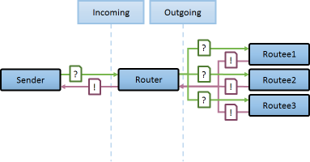
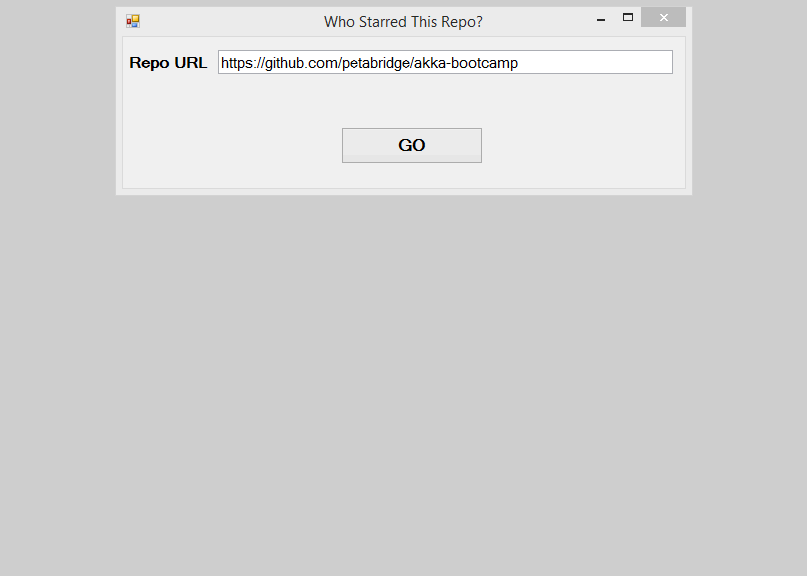
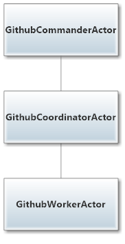
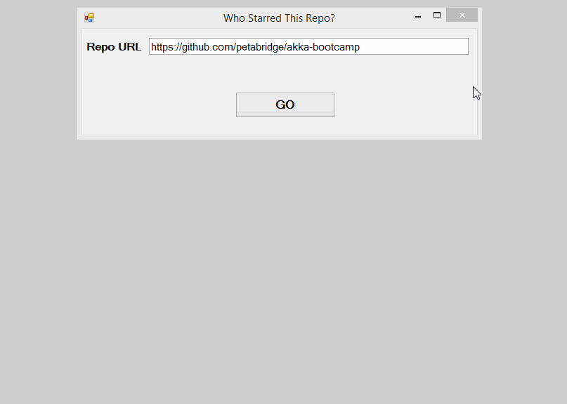
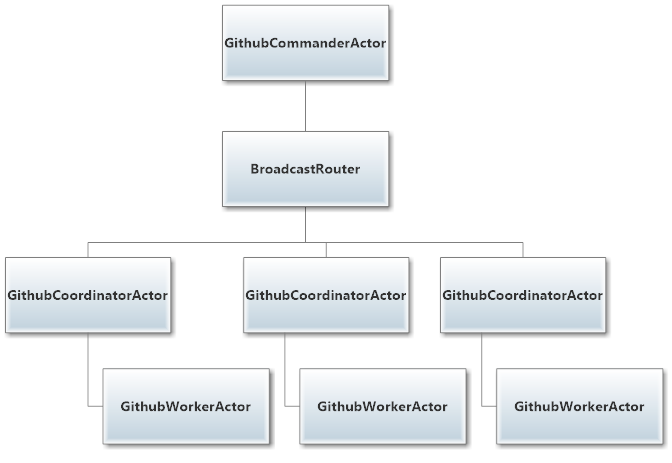

# Lesson 3.1: Using `Group` routers to divide work among your actors
Welcome to Unit 3! As you know, this unit focuses on making our actor systems more scalable, resilient, and parallelized.

Over the course of Unit 3, you're going to build a sophisticated GitHub scraper that can simultaneously retrieve data from multiple GitHub repos at once. This system will also be able to fetch information about the GitHubbers who have participated in those repos (e.g. starred or forked). By the end, we'll have a nicely scalable system for retrieving data from the GitHub API, capable of coordinating a huge amount of data retrieval in parallel!

> ***Heads up: This lesson is the most critical (and longest) of all the lessons in Unit 3. Grab some coffee and get comfortable!***

The most important new concept we need to learn is `Router`s ([docs](http://getakka.net/articles/actors/routers.html)). Let's get going.

## Key Concepts / Background
### `Router`s
#### What is a `Router`?
A `Router` is a special kind of actor that acts as a messaging hub to a group of other actors. The purpose of a `Router` is to divide and balance work (represented as message streams) across some group of other actors, which will actually do the work.

#### What's special about a `Router`?
A `Router` actually *is* an actor, but with one critical difference: it can process more than one message at a time.

**Wait, what? I thought all actors only processed one message at a time?!**
That is true for 99.999% of cases. But remember: *The purpose of a `Router` is to route messages onward, NOT to process them.*

Since a `Router` does not need to actually process messages and take any significant action on the message—it just has to forward the message on to another actor—it can break the "one message at a time" rule and everything is fine. In fact, it's better that way. Why?

#### What does a `Router` give me?
***Fundamentally, what a `Router` gives you is massive message throughput and scalability***.

`Router`s are the critical component that breaks down large data streams into easily managed ones. `Router`s allow you to divide up a huge amount of work across a group of actors and scale up processing easily.

On the surface, `Router`s look like normal actors, but they are actually implemented differently. Routers are designed to be extremely efficient at one thing: receiving messages and quickly passing them on to routees.

A normal actor *can* be used for routing messages, but a normal actor's single-threaded processing can become a bottleneck. Routers achieve much higher throughput by changing the usual message-processing pipeline to allow concurrent message routing. This is achieved by embedding the routing logic of a `Router` directly in their `ActorCell` itself (the mesh between the actor's mailbox and the actor,) rather than in the receive loop / message-handling code of the router actor. This way, messages sent to a router's `ActorRef` are immediately routed to the routee, bypassing the single-threaded message-handling code of the router's actor entirely.

Fortunately, *all of this complexity is invisible to consumers of the routing API*.

#### Okay, what kinds of `Router`s are there?
There are two types of routers: Pool routers, and Group routers.

##### Pool Routers
A "Pool" router is a `Router` that creates and manages its worker actors ("routees"). You provide a `NrOfInstances` to the router and the router will handle routee creation (and supervision) by itself.

> **We cover Pool routers in depth in lesson 2**.

##### Group Routers
A group router is a router that does not create/manage its routees. It only forwards them messages. You specify the routees when creating the group router by passing the router the `ActorPath`s for each routee.

In this lesson, we'll be working with Group routers.

#### How do I configure a `Router`?
You can configure a router directly in your code (dubbed "procedural" or "programmatic" configuration), or you can configure the router using HOCON and  `App.config`.

We'll use procedural configuration in this lesson and the next, but go in depth on using HOCON to configure routers in Lesson 3.

#### When a routee gets a message, is the `Sender` the `Router`, or the actor that sent the message to the `Router`?
Great question. Glad you asked!

The `Sender` of a message delivered to a routee is the actor who sent the message to the router. The router just forwards the message. A router is effectively transparent, and only works in one direction: to its routees.

So, if the routee replies to the message, that response will go to the original actor, bypassing the router altogether. When replying this way, the routee can also specify the router as the `Sender` for its response, so that any follow-up reply from the original actor flows back through the router.

#### How does a `Router` know where to forward a message?
A `Router` decides how to distribute messages to its routees based on the `RoutingStrategy` you assign it.

### Routing Strategies
A `RoutingStrategy` encapsulates the logic used by a router to distribute messages to its routees.

There are quite a few types of `RoutingStrategy` available to you out of the box. But, we divide them into two general categories: *special-case strategies*, and *load balancing strategies*.

You can also define your own `RoutingStrategy`, but that's quite complex and beyond the scope of this course.

Let's go over these message routing strategies.

### Special-case `RoutingStrategy`s
Each of these is a `RoutingStrategy` with a specialized purpose.

1. `Broadcast`
2. `Random`
3. `ConsistentHash`

#### `Broadcast`
Under this `RoutingStrategy`, the router will forward any message it receives to ***ALL*** of its routees.

Here's what the `Broadcast` `RoutingStrategy` looks like:


#### `Random`
Under the `Random` `RoutingStrategy`, each time the `Router` receives a message, it will pick a routee at random to forward the message to.

The router will repeat this process each time it receives a message, so messages 1, 2, 3...N will each be sent to a randomly selected actor.

#### `ConsistentHash`
With the `ConsistentHash` `RoutingStrategy`, the `Router` uses consistent hashing to select the routee based on the data of the message that was sent.

This has a specific use case where you want the routing of the message to depend on the message itself. For example, imagine that you had a system that needed to process events on a per-user level. To do this, your analytics events could flow to a `ConsistentHashRouter` that then forwards the event message on to a per-user `UserEventTrackingActor`, which will track all the events for that given user. The hash key would probably be the user UUID contained inside each of the user-generated events.

Here's what the `ConsistentHash` `RoutingStrategy` looks like:


### Load balancing `RoutingStrategy`s
These routing strategies are all different approaches to the same goal: *attempting to evenly distribute work across the group*.

1. `RoundRobin`
1. `SmallestMailbox`
1. `TailChopping`
1. `Resizable`
1. `ScatterGatherFirstCompleted`

Let's review them quickly.

#### `RoundRobin`
Under this `RoutingStrategy`, the router will use [round-robin](https://en.wikipedia.org/wiki/Round-robin_scheduling) to select a routee. For concurrent calls, `RoundRobin` is just a best effort—meaning that the router makes no complex effort to determine which routee is best suited for a message, it just sends it to the next in the round robin pattern and advances.

Here's what the `RoundRobin` `RoutingStrategy` looks like:


***In practice, a `RoundRobin` strategy is going to be fine for most situations and should be your go-to load balancing `RoutingStrategy`***.

However, if you find yourself with a router under *massive* load (e.g. 10s of millions of messages per second) or needing a unique pattern, then you may want to look at the more esoteric load balancing strategies that follow.

#### `TailChopping`
The TailChoppingRouter will first send the message to one, randomly picked, routee and then after a small delay to to a second routee (picked randomly from the remaining routees) and so on. It waits for first reply it gets back and forwards it back to original sender. Other replies are discarded.

The goal of this router is to decrease latency by performing redundant queries to multiple routees, assuming that one of the other actors may still be faster to respond than the initial one.

#### `ScatterGatherFirstCompleted`
The `ScatterGatherFirstCompletedRouter` will send the message on to all its routees. It then waits for first reply it gets back. This result will be sent back to original sender. Other replies are discarded.

`ScatterGatherFirstCompletedRouter` expects at least one reply within a configured duration, otherwise it will reply to its `Sender` with an exception.

Here's what `ScatterGatherFirstCompleted` looks like:



#### `SmallestMailbox`
This `RoutingStrategy` only works with Pool routers, so we'll cover it in the next lesson.

#### `ResizableRouter`
This `RoutingStrategy` only works with Pool routers, so we'll cover it in the next lesson.

### Special `Router` messages
Regardless of its `RoutingStrategy`, there are a few special messages that you can send to a `Router` to cause certain behaviors.

#### `Broadcast`
Sending a `Broadcast` message to a non-`Broadcast` router makes the router act like a `BroadcastRouter` for that single message. After the message is processed, the router will return to its normal `RoutingStrategy`.

When would you use this? It doesn't come up very often, but one use case we can think of is if you a group of routees all needed to take some action in response to a global-level event.

For example, perhaps you have a group of actors that all must be alerted if a critical system goes down. In this case, you could send their router a `Broadcast` message and all the routees would be alerted.

```fsharp
// tell a router to broadcast message to all its routees
// regardless of what type of router it actually is
router <! Broadcast("Shields failing, Captain!")
```

#### `GetRoutees`
The `GetRoutees` message type tells a router to return a list of its routees. This is most commonly used for debugging, but in our example we'll also use it to track how many jobs are open.

```fsharp
// get a list of a routers routees
router <! GetRoutees()
```

#### `PoisonPill`
A `PoisonPill` message has special handling for all actors, including for routers. When any actor receives a `PoisonPill` message, that actor will be stopped immediately.

For a group router, this only stops the router and does not stop its routees. For a pool router, it will also have the effect of shutting down its child routees as they are supervised children of the router.

Sending a `PoisonPill` will terminate any actor immediately:

```fsharp
// kill router actor
router <! PoisonPill.Instance
```

Great! Now that you know what the different kinds of routers are, and how to use them, let's wrap up by covering how group routers and their routees recover from failures.

### How does supervision work with Group routers?
*A group router does not supervise its routees.*

Recall that group routers do not create their routees, but instead are passed the `ActorPath`s of their routees. This means that those routees exist somewhere else in the hierarchy, and are managed by whatever other parent actors created them.

Practically, this means that a group router usually won't know that its routees have died. A group router will attempt to [`DeathWatch`](http://getakka.net/wiki/Supervision#what-lifecycle-monitoring-means) its routees, but it doesn't always succeed in subscribing. Much of this is due to the fact that `ActorPath`s can have wildcards.

#### Isn't it bad that group routers usually don't know their routees have died?
Yes, it is bad.

This is one of the key reasons that, in general, *we recommend using pool routers instead of group routers*.

In this lesson, we're only using group routers, but going forward we'll be using pool routers almost exclusively.

Phew! That was a LOT of new information. Now let's put it to use and make something!

## Exercise

If you build and run `GithubActors.sln`, you'll notice that we can only process one GitHub repository at a time right now:




The current state of our actor hierarchy for processing GitHub repositories currently looks like this:



We're going to modify the `GithubCommanderActor` to use a `BroadcastGroup` router so we can run multiple jobs in parallel by the end of this lesson!

### Phase 1 - Add switchable behaviors to the `GithubCommanderActor`
Let split the logic of `GithubCommanderActor` into two different states: `ready` and `asking`.
This is the new code for the `ready` state:


```fsharp
// pass around the actor that sent the CanAcceptJob message as well as the current number of pending jobs
let rec ready canAcceptJobSender pendingJobReplies =
    actor {
        let! message = mailbox.Receive ()

        match message with
        | CanAcceptJob repoKey ->
            coordinator <! CanAcceptJob repoKey
            return! asking mailbox.Context.Sender 3 // 3 pending job replies
        | _ -> return! ready canAcceptJobSender pendingJobReplies
    }
```

You will notice that we now pass around the `pendingJobReplies` that represents the number of jobs currently running. When the first job is launched, we arbitrarily set this number to 3, meaning that the scraper will now be able to run up to 3 jobs at the same time!

and this is the code for the `asking` state:

```fsharp
// pass around the actor that sent the CanAcceptJob message as well as the current number of pending jobs
and asking canAcceptJobSender pendingJobReplies =
    actor {
        let! message = mailbox.Receive ()

        match message with
        | CanAcceptJob repoKey ->
            mailbox.Stash ()
            return! asking canAcceptJobSender pendingJobReplies
        | UnableToAcceptJob repoKey ->
            let currentPendingJobReplies = pendingJobReplies - 1
            if currentPendingJobReplies = 0 then
                canAcceptJobSender <! UnableToAcceptJob repoKey
                mailbox.UnstashAll ()
                return! ready canAcceptJobSender currentPendingJobReplies
            else
                return! asking canAcceptJobSender currentPendingJobReplies
        | AbleToAcceptJob repoKey ->
            canAcceptJobSender <! AbleToAcceptJob repoKey
            mailbox.Context.Sender <! BeginJob repoKey // start processing messages
            mailbox.Context.ActorSelection "akka://GithubActors/user/mainform" <! LaunchRepoResultsWindow(repoKey, mailbox.Context.Sender) // launch the new window to view results of the processing
            mailbox.UnstashAll ()
            return! ready canAcceptJobSender pendingJobReplies
        | _ -> return! asking canAcceptJobSender pendingJobReplies
    }

ready null 0
```

Here the interesting part is within the `UnableToAcceptJob` case. When we receive an `UnableToAcceptJob` message from one of the underlying coordinators, we interpret it as the coordinator being busy. If all coordinators (3 here) are currently busy, we tell our `githubValidatorActor` that we're not ready to handle the next job just yet.

### Phase 2 - Modify the pre-start logic of `GithubCommanderActor` to configure the `coordinator` as a group router
The `GithubCommanderActor` is responsible for creating one `GithubCoordinatorActor`, who manages and coordinates all of the actors responsible for downloading data from GitHub via [Octokit](http://octokit.github.io/).

We're going to change the `GithubCommanderActor` to actually create 3 different `GithubCoordinatorActor` instances, and we're going to use a `BroadcastGroup` to communicate with them!

Replace the pre-start logic of `GithubCommanderActor` with the following:

```fsharp
// pre-start
let c1 = spawn mailbox.Context "coordinator1" (githubCoordinatorActor)
let c2 = spawn mailbox.Context "coordinator2" (githubCoordinatorActor)
let c3 = spawn mailbox.Context "coordinator3" (githubCoordinatorActor)

//create a broadcast router who will ask all of the coordinators if they are available for work
let coordinatorPaths = [| string c1.Path; string c2.Path; string c3.Path |]
let coordinator = mailbox.Context.ActorOf(Props.Empty.WithRouter(BroadcastGroup(coordinatorPaths)))
```

By the way, don't forget to add this new `open` directive at the top of the file to be able to use `BroadcastGroup`:

```fsharp
open Akka.Routing
```

And with that, you're all set! The main coordinator (last line) will now route incoming message to all three `githubCoordinatorActor` instances.

### Once you're done

You should be able to run `GithubActors.sln` now and see that you can launch up to three jobs in parallel - a big improvement that didn't take very much code!



As a result of the changes you made, the actor hierarchy for GithubActors now looks like this:



Now we have 3 separate `GithubCoordinatorActor` instances that are all available for GitHub repository analysis jobs.

## Great job!

Awesome job! You've successfully used Akka.NET routers to achieve the first layer of parallelism we're going to add to our GitHub scraper!

**Let's move onto [Lesson 2 - Using `Pool` routers to automatically create and manage pools of actors](../lesson2).**

## Any questions?
**Don't be afraid to ask questions** :).

Come ask any questions you have, big or small, [in this ongoing Bootcamp chat with the Petabridge & Akka.NET teams](https://gitter.im/petabridge/akka-bootcamp).

### Problems with the code?
If there is a problem with the code running, or something else that needs to be fixed in this lesson, please [create an issue](/issues) and we'll get right on it. This will benefit everyone going through Bootcamp.
