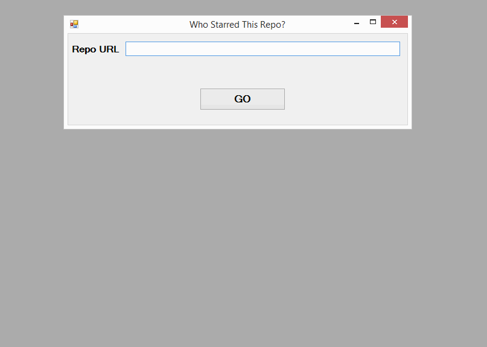
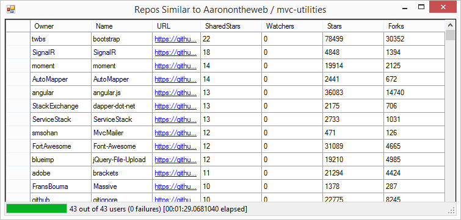

# Lesson 3.5: How to prevent deadlocks with `ReceiveTimeout`
Wow, look at you! Here we are on our last lesson of Bootcamp together. We want to say thank you for coming on this journey with us, and to give yourself a big pat on the back for your dedication to your craft.

In this lesson, we'll be going over how to handle timeouts within actors and prevent deadlocks, where one actor is waiting for another indefinitely.

This lesson will show you how to prevent deadlocks by using a `ReceiveTimeout`.

## Key Concepts / Background
### What is `ReceiveTimeout`?
`ReceiveTimeout` lets you specify what an actor should do when it hasn't received a message for a certain period of time. Once this timeout has been hit, the actor will send itself the `ReceiveTimeout` singleton as a message.

Once set up, the `ReceiveTimeout` stays in effect and will continue firing repeatedly every time the specified interval passes without the actor receiving a message.

### When do I use `ReceiveTimeout`?
You can use `ReceiveTimeout` whenever you want to take some action after a period of inactivity.

Here are some common cases where you may want to use a `ReceiveTimeout`:

- To shut an actor down after it goes a certain amount of time without receiving a message
- To confirm that other actors are doing work and sending in their status messages
- To prevent deadlocks where one actor thinks another is doing work

### How do I set up a `ReceiveTimeout`?
You call `Context.SetReceiveTimeout` and pass it a `TimeSpan`. If that amount of time passes and the actor hasn't received a message, the actor will send itself the `ReceiveTimeout` singleton as a message, e.g.

```fsharp
// send ourselves a ReceiveTimeout message if no message within 3 seconds
mailbox.Context.SetReceiveTimeout (Nullable(TimeSpan.FromSeconds 3.))
```

Then, you just need to handle the `ReceiveTimeout` message and take whatever action is appropriate.

Let's assume you wanted to shut an actor down after a period of inactivity, and inform its parent. Here's one basic way you could do that:

```fsharp
// inside an actor expression
let! message = mailbox.Receive ()

match box message with
| :? ReceiveTimeout as timeout ->
    // inform parent that I'm shutting down
    mailbox.Context.Parent <! ImShuttingDown()
    // shut self down
    mailbox.Context.Stop mailbox.Self
// rest of the cases
```

### How do I cancel a `ReceiveTimeout` that I've set?
You call `Context.SetReceiveTimeout` and pass it `null`, e.g.

```fsharp
// cancel ReceiveTimeout
mailbox.Context.SetReceiveTimeout (Nullable())
```

### Can I change the timeout value?
Yes, you can set the `ReceiveTimeout` after every message, or as often as you want. Setting a new timeout will cancel the previous timeout and schedule a new one.

### What's the smallest `ReceiveTimeout` interval I can specify?
1 millisecond is the minimum timeout interval.

### Does `ReceiveTimeout` work with all actor types?
Yes, you can use `ReceiveTimeout` with any actor type.

### What if another message comes in right before I process the timeout?
`ReceiveTimeout` can create false positives. For example, it's possible for the timeout to occur and another message to arrive in the actors mailbox before the `ReceiveTimeout` message does. In this case, another message would get processed before the `ReceiveTimeout` message, making it invalid.

It is not *guaranteed* that upon reception of the `ReceiveTimeout` that there must have been an idle period beforehand as configured via this method.

This is an edge case, but there are ways to code around it.

## Exercise
We're going to use `ReceiveTimeout` to eliminate a potential deadlock that might occur inside the `githubCommanderActor` - if one of the `githubCoordinatorActor` it routes to suddenly dies before it has a chance to reply to a `CanAcceptJob` message, the `githubCommanderActor` will be permanently stuck in its `asking` state.

We can prevent this from happening using `ReceiveTimeout`!

### Phase 1 - Add a new private field to the `githubCommanderActor`
We're going to hang onto the current job we're inquiring about as an instance variable inside the `githubCommanderActor`, so open up `Actors.fs` and make the following changes:

```fsharp
// add this field before the ready state in githubCommanderActor
let mutable currentRepoKey: RepoKey = { Owner = ""; Repo = "" }
```

And modify the ready state in githubCommanderActor to look like this:

```fsharp
let rec ready canAcceptJobSender pendingJobReplies =
    actor {
        let! message = mailbox.Receive ()

        match box message with
        | :? GithubActorMessage as githubMessage ->
            match githubMessage with
            | CanAcceptJob repoKey ->
                coordinator <! CanAcceptJob repoKey
                currentRepoKey <- repoKey // store the current repoKey

                let routees: Routees = coordinator <? GetRoutees() |> Async.RunSynchronously

                mailbox.Context.SetReceiveTimeout (Nullable(TimeSpan.FromSeconds 3.)) // set the receive timeout to 3s
                return! asking mailbox.Context.Sender (routees.Members.Count ())
            | _ -> return! ready canAcceptJobSender pendingJobReplies
        | _ -> return! ready canAcceptJobSender pendingJobReplies
    }
// rest of the code...
```

We made 3 changes here:
- first we needed to change the type of messages that `githubCommanderActor` can handle. Now not only handle can it handle `GithubActorMessage`s, it should also handle `ReceiveTimeout` messages.
- we now store the current `repoKey` in our new `currentRepoKey` variable.
- we set the `ReceiveTimeout` property of the actor to 3 seconds.

This means that once the `githubCommanderActor` enters the `asking` behavior, it will automatically send itself a `ReceiveTimeout` message if it hasn't received any other message for longer than three seconds.

Speaking of which, let's add a handler for the `ReceiveTimeout` message type inside the `asking` method on `githubCommanderActor`.

```fsharp
and asking canAcceptJobSender pendingJobReplies =
    actor {
        let! message = mailbox.Receive ()

        match box message with
        // The new case to handle ReceiveTimeout messages
        | :? ReceiveTimeout as timeout ->
            canAcceptJobSender <! UnableToAcceptJob currentRepoKey // send UnableToAccepJob to the repoKey we've just stored
            mailbox.UnstashAll ()
            mailbox.Context.SetReceiveTimeout (Nullable()) // cancel ReceiveTimeout
            return! ready canAcceptJobSender pendingJobReplies

        | :? GithubActorMessage as githubMessage ->
            match githubMessage with
            // code that handles GitHubActorMessages (same as before)
        | _ -> return! asking canAcceptJobSender pendingJobReplies
    }
```

We're going to treat every `ReceiveTimeout` as a "busy" signal from one of the `githubCoordinatorActor` instances so we'll send ourselves a `UnableToAcceptJob` message every time we receive a `ReceiveTimeout`.

Once the `githubCommanderActor` has received all of the replies its expecting and it switches back to its `Ready` state, we need to cancel the `ReceiveTimeout`.

Modify the `githubCommanderActor` to cancel `ReceiveTimeout` every time it returns to the `ready` state:

```fsharp
| :? GithubActorMessage as githubMessage ->
    match githubMessage with
    | CanAcceptJob repoKey ->
        mailbox.Stash ()
        return! asking canAcceptJobSender pendingJobReplies
    | UnableToAcceptJob repoKey ->
        let currentPendingJobReplies = pendingJobReplies - 1
        if currentPendingJobReplies = 0 then
            canAcceptJobSender <! UnableToAcceptJob repoKey
            mailbox.UnstashAll ()
            mailbox.Context.SetReceiveTimeout (Nullable()) // reset ReceiveTimeout
            return! ready canAcceptJobSender currentPendingJobReplies
        else
            return! asking canAcceptJobSender currentPendingJobReplies
    | AbleToAcceptJob repoKey ->
        canAcceptJobSender <! AbleToAcceptJob repoKey
        mailbox.Context.Sender <! BeginJob repoKey
        mailbox.Context.ActorSelection "akka://GithubActors/user/mainform" <! LaunchRepoResultsWindow(repoKey, mailbox.Context.Sender)
        mailbox.UnstashAll ()
        mailbox.Context.SetReceiveTimeout (Nullable()) // reset ReceiveTimeout
        return! ready canAcceptJobSender pendingJobReplies
    | _ -> return! asking canAcceptJobSender pendingJobReplies
| _ -> return! asking canAcceptJobSender pendingJobReplies
```

And that's it!

### Once you're done
Build and run `GithubActors.sln`, and you should see the following output if you try querying the [Akka.NET GitHub Repository](https://github.com/akkadotnet/akka.net) (go give them a star while you're at it!)



And here's what the final output looks like - sadly, for a different repo since hit the GitHub API rate limit with Akka.NET :(



## Great job!
Wow! You made it, awesome!

We're really proud of you, and want to express our gratitude for sticking with us all the way through. Thank you, and kudos to you. Your dedication to your craft inspires us.

## Sharing is caring: [click here to Tweet about Bootcamp!](http://ctt.ec/L_Xe0) (you can edit first)

We want to help more people get this knowledge and learn to use Akka.NET. Direct them to the [Bootcamp information page](http://learnakka.net) or to this repo.

If we at Petabridge can be of any help to you whatsoever, [please reach out to us by email](mailto:hi@petabridge.com) or say hello <a href="https://twitter.com/petabridge">on Twitter</a>.

### Want to level up your company or team with Akka.NET?
[Please email us](mailto:hi@petabridge.com) to discuss your situation.

We work with companies all the time to **implement production systems and do advanced Akka.NET training** (Clustering, Remoting, Testing, DevOps, best practices, etc).

We'd love to help you, too.

Gratefully,<br>
Aaron & Andrew<br>
Petabridge co-founders

## Any questions?
**Don't be afraid to ask questions** :).

Come ask any questions you have, big or small, [in this ongoing Bootcamp chat with the Petabridge & Akka.NET teams](https://gitter.im/petabridge/akka-bootcamp).

### Problems with the code?
If there is a problem with the code running, or something else that needs to be fixed in this lesson, please [create an issue](/issues) and we'll get right on it. This will benefit everyone going through Bootcamp.

